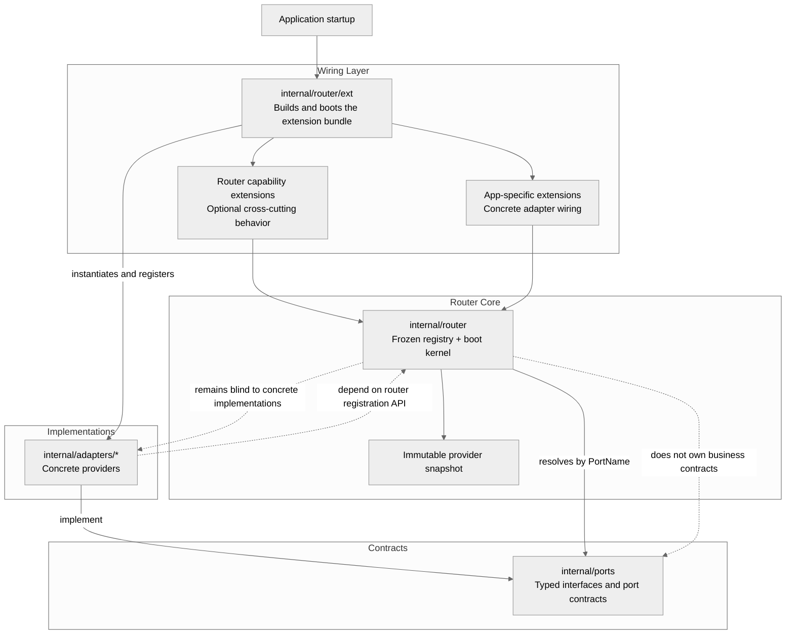

# Router Package

`internal/router` is a small, zero-dependency composition router for Go applications. It gives the application one explicit place to register providers behind typed port names, boot extensions in dependency order, and publish a single immutable registry snapshot that consumers can resolve from without runtime wiring logic scattered across the codebase.

The package supports two extension types. Router capability extensions add optional infrastructure concerns such as telemetry and other cross-cutting behavior, while app-specific extensions wire the concrete adapters your application actually runs behind its declared ports. The package is intentionally split into a frozen core and an app-owned wiring layer: the core stays contract-blind and fast, `internal/router/ext/optional_extensions.go` owns capability extensions, and `internal/router/ext/extensions.go` owns required application adapter wiring. A local `wrlk` tool and `router.lock` keep changes to the router surface explicit, reviewable, and hard to drift by accident.

## Architecture



## What It Does

- Registers providers behind typed `PortName` values
- Boots optional extensions before required application extensions
- Orders extension startup from declared `Consumes()` and `Provides()` dependencies
- Publishes one immutable snapshot for lock-free provider resolution
- Supports router-native CLI output and interaction capabilities through semantic contracts
- Supports boot-time warnings, fatal failures, rollback hooks, and restricted port access
- Protects the router kernel with `router.lock` and the `wrlk` scaffolding/verification workflow

## Key Files

- `internal/router/extension.go`: core boot contracts and orchestration
- `internal/router/registry.go`: provider resolution
- `internal/router/ext/optional_extensions.go`: optional capability wiring
- `internal/router/ext/extensions.go`: required application wiring
- `internal/router/tools/wrlk`: port and extension scaffolding, lock commands

## Basic Use

Boot once:

```go
ctx, cancel := context.WithTimeout(context.Background(), 30*time.Second)
defer cancel()

warnings, err := ext.RouterBootExtensions(ctx)
if err != nil {
	log.Fatal(err)
}

for _, warning := range warnings {
	log.Println("router warning:", warning)
}
```

Resolve later:

```go
provider, err := router.RouterResolveProvider(router.PortPrimary)
if err != nil {
	return err
}

primary, ok := provider.(ports.PrimaryProvider)
if !ok {
	return &router.RouterError{
		Code: router.PortContractMismatch,
		Port: router.PortPrimary,
	}
}
```

## CLI

```bash
go run ./internal/router/tools/wrlk add --name PortFoo --value foo
go run ./internal/router/tools/wrlk ext add --name telemetry
go run ./internal/router/tools/wrlk ext install --name telemetry
go run ./internal/router/tools/wrlk ext app add --name billing
go run ./internal/router/tools/wrlk lock verify
```

Use:
- `ext add` to scaffold and wire a new optional capability extension in `optional_extensions.go`
- `ext install` to wire an existing optional capability extension in `optional_extensions.go`
- `ext remove` to unwire an optional capability extension from `optional_extensions.go`
- `ext app add` to wire an existing application adapter from `internal/adapters/<name>` into `extensions.go`
- `ext app remove` to unwire an application adapter from `extensions.go`

For the CLI capability split:
- `PortCLIStyle` should stay owned by `prettystyle` for output concerns such as text, tables, and semantic layouts.
- `PortCLIChrome` should be owned by `charmcli` for themed text and layout chrome.
- `PortCLIInteraction` should stay owned by `charmcli` for interactive prompt flows.
- The app should resolve these capabilities separately instead of trying to stack multiple providers behind one router port.

## Important Rule

`internal/router/ext/extensions.go` is intentionally app-owned and starts empty. Do not leave sample or unused providers wired there.

## Optional Dependencies

`testify` is used by the repository test suite. Other third-party dependencies, such as renderer libraries used by optional extensions, are only needed when you choose to keep and build those extensions.

If you do not use an optional extension, its dependency is not part of the required application contract. The router core itself remains intentionally small and does not require extension-specific libraries unless you wire and ship that extension.

## Docs

- [Usage](docs/documentation/usage.md)
- [Extension Authoring](docs/documentation/extensions.md)
- [CLI Tools](docs/documentation/cli-tools.md)
- [Architecture](docs/documentation/architecture.md)
- [Troubleshooting](docs/documentation/troubleshooting.md)

## Example Consumer

- [policycheck](https://github.com/michaelbomholt665/policycheck) is an example repository that uses this router pattern in a real application.
