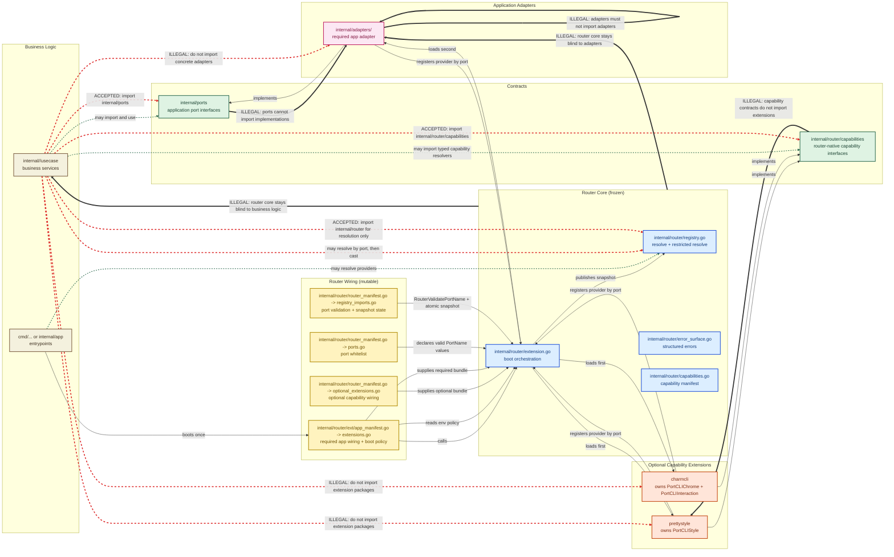

# Router Package

`internal/router` is a small port registry and extension boot layer for Go applications. It gives the application one explicit place to register providers behind typed port names, boot extensions in dependency order, and publish one immutable registry snapshot that consumers can resolve from without runtime wiring logic scattered across the codebase.

The package supports two extension categories. Optional capability extensions add router-native infrastructure such as CLI styling and interaction, while required application extensions wire the concrete adapters your application actually runs behind its declared ports. The package is intentionally split into a frozen core and manifest-backed wiring layers: `internal/router/router_manifest.go` owns router-native port and optional extension declarations, `internal/router/ext/app_manifest.go` owns required application extension declarations, and `wrlk register` regenerates the runtime files from those manifests. A local `wrlk` tool and `router.lock` keep the managed router surface explicit, reviewable, and hard to drift by accident.

## Architecture



## What It Does

- Registers providers behind typed `PortName` values
- Boots optional extensions before required application extensions
- Orders extension startup from declared `Consumes()` and `Provides()` dependencies
- Publishes one immutable snapshot for lock-free provider resolution
- Supports router-native CLI output and interaction capabilities through semantic contracts
- Supports boot-time warnings, fatal failures, rollback hooks, restricted port access, and boot-policy validation
- Protects the router kernel with `router.lock` and the `wrlk` scaffolding/verification workflow

## Key Files

- `internal/router/extension.go`: core boot contracts and orchestration
- `internal/router/registry.go`: provider resolution and restricted resolution
- `internal/router/error_surface.go`: router error rendering
- `internal/router/capabilities.go`: declared capability manifest
- `internal/router/router_manifest.go`: router-native port and optional extension declarations
- `internal/router/ext/app_manifest.go`: required application extension declarations
- `internal/router/ext/optional_extensions.go`: generated optional capability wiring
- `internal/router/ext/extensions.go`: generated required application wiring and boot policy wrapper
- `internal/router/tools/wrlk`: port and extension scaffolding, lock commands

## Basic Use

Boot once:

```go
ctx, cancel := context.WithTimeout(context.Background(), 30*time.Second)
defer cancel()

warnings, err := ext.RouterBootExtensions(ctx)
if err != nil {
	log.Fatal(err)
}

for _, warning := range warnings {
	log.Println("router warning:", warning)
}
```

Resolve later:

```go
provider, err := router.RouterResolveProvider(router.PortPrimary)
if err != nil {
	return err
}

primary, ok := provider.(ports.PrimaryProvider)
if !ok {
	return &router.RouterError{
		Code: router.PortContractMismatch,
		Port: router.PortPrimary,
	}
}
```

For router-native CLI capabilities, prefer the typed resolvers in `internal/router/capabilities/`:

```go
styler, err := capabilities.ResolveCLIOutputStyler()
chrome, err := capabilities.ResolveCLIChromeStyler()
interactor, err := capabilities.ResolveCLIInteractor()
```

## CLI

```bash
go run ./internal/router/tools/wrlk register --port --router --name PortFoo --value foo
go run ./internal/router/tools/wrlk register --ext --router --name telemetry
go run ./internal/router/tools/wrlk register --ext --app --name billing
go run ./internal/router/tools/wrlk lock verify
go run ./internal/router/tools/wrlk live run --expect scanner-a --expect scanner-b
```

Use:
- `register --port --router` to add a router port in `router_manifest.go`
- `register --ext --router` to wire an optional capability extension in `router_manifest.go`
- `register --ext --app` to wire a required application extension in `app_manifest.go`
- `ext remove` to unwire an optional capability extension from `optional_extensions.go`
- `ext app remove` to unwire a required application extension from `extensions.go`
- `live run` to start a bounded live verification session for local or otherwise trusted-network use

For the CLI capability split:
- `PortCLIStyle` should stay owned by `prettystyle` for output concerns such as text, tables, and semantic layouts.
- `PortCLIChrome` should be owned by `charmcli` for themed text and layout chrome.
- `PortCLIInteraction` should stay owned by `charmcli` for interactive prompt flows.
- The app should resolve these capabilities separately instead of trying to stack multiple providers behind one router port.

## Important Rule

`internal/router/ext/extensions.go` is intentionally generated from `internal/router/ext/app_manifest.go`. It may legitimately be empty when the application has no required adapters to wire there. Do not leave sample or unused providers wired there, and do not treat the generated file as the edit surface.

`wrlk live run` is not suitable for internet exposure as-is. Before exposing it remotely, add authenticated session tokens, bounded request sizes, explicit server timeouts, and rate limiting.

Business logic should import `internal/ports` and, when needed, `internal/router/capabilities` or `internal/router` for resolution. It should not import concrete adapters or concrete extension packages.

## Optional Dependencies

`testify` is used by the repository test suite. Other third-party dependencies, such as renderer libraries used by optional extensions, are only needed when you choose to keep and build those extensions.

If you do not use an optional extension, its dependency is not part of the required application contract. The router core itself remains intentionally small and does not require extension-specific libraries unless you wire and ship that extension.

## Docs

- [Usage](docs/documentation/usage.md)
- [Extension Authoring](docs/documentation/extensions.md)
- [CLI Tools](docs/documentation/cli-tools.md)
- [Architecture](docs/documentation/architecture.md)
- [Troubleshooting](docs/documentation/troubleshooting.md)

## Example Consumer

- [policycheck](https://github.com/michaelbomholt665/policycheck) is an example repository that uses this router pattern in a real application.
