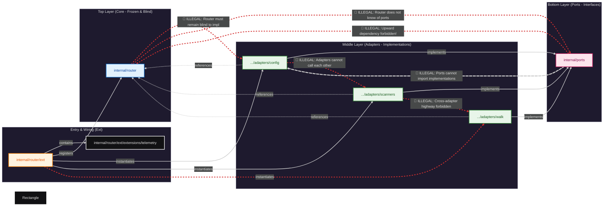

# Router Package

A zero-dependency port registry and extension boot machinery for Go applications.

## Overview

The router implements an extension-based dependency injection system with:

- **Port-based registry**: Providers are registered and resolved by named ports
- **Extension lifecycle**: Required and optional extensions with async initialization support
- **Lock-free reads**: Atomic pointer-based registry for high-performance concurrent access
- **Structured errors**: Comprehensive error catalog with contextual error messages

## Architecture



## Core Concepts

### Ports

Ports are typed identifiers for provider capabilities:

| Port            | Description                        |
| --------------- | ---------------------------------- |
| `PortPrimary`   | Primary provider port              |
| `PortSecondary` | Secondary provider port            |
| `PortTertiary`  | Tertiary provider port             |
| `PortOptional`  | Optional provider port (telemetry) |

### Extensions

Extensions register providers during boot:

- **Required**: Boot fails if registration fails
- **Optional**: Boot continues with warnings on failure
- **Async**: Support for asynchronous initialization
- **Topological sorting**: Extensions are sorted by dependency order

### Registry

The registry uses `atomic.Pointer` for lock-free reads after boot:

```go
provider, err := router.RouterResolveProvider(router.PortPrimary)
```

## CLI Tools

### wrlk

Manage port generation, router lock verification, and live sessions:

```bash
# Add a new port
go run ./internal/router/tools/wrlk add --name PortFoo --value foo

# Dry-run a new port addition
go run ./internal/router/tools/wrlk add --name PortFoo --value foo --dry-run

# Verify lock file
go run ./internal/router/tools/wrlk lock verify

# Update lock file
go run ./internal/router/tools/wrlk lock update

# Restore lock file
go run ./internal/router/tools/wrlk lock restore

# Run live verification
go run ./internal/router/tools/wrlk live run --expect participant1 --timeout 30s

# Scaffold a new extension
go run ./internal/router/tools/wrlk ext add --name ExtensionName

# Show operational guide
go run ./internal/router/tools/wrlk guide
```

## File Structure

```
internal/router/
├── doc.go                 # Package documentation
├── ports.go               # Port type definitions
├── registry.go            # Provider resolution
├── registry_imports.go    # Registry implementation
├── extension.go           # Extension interfaces & boot
├── error_surface.go       # Error handling
├── test_reset.go          # Test utilities
├── router.lock            # Lock file (anti-tampering)
├── ext/
│   ├── doc.go
│   ├── extensions.go      # Required/application extensions
│   ├── optional_extensions.go  # Optional extensions (capabilities that extend without adding dependencies to core)
│   └── extensions/
│       └── telemetry/    # Optional telemetry extension
└── tools/
    └── wrlk/              # CLI tools (portgen, lock, live, ext)

internal/tests/router/
├── boot_test.go
├── restricted_test.go
├── registration_test.go
├── resolution_test.go
├── helpers_test.go
├── benchmark_test.go
├── ext_boot_test.go
└── tools/
    └── wrlk/              # CLI tool tests
```

## Design Principles

1. **Zero dependencies in core**: `internal/router` imports nothing from internal packages
2. **Clean architecture**: Extensions implement ports defined in `internal/router`
3. **Type safety**: Port names are strongly typed
4. **Immutable after boot**: Registry is read-only after initialization
5. **Fail fast**: Required extension failures abort boot immediately
6. **Lock protection**: Core files are checksum-protected via `router.lock`

## Lock Protocol

The router core is protected by `router.lock`. Manual edits to core files will fail lock verification:

- Use `wrlk add` to add new ports (automates updates and lock recalculation)
- Use `wrlk lock verify` to detect drift
- Use `wrlk lock restore` to revert local changes

## Error Codes

| Code                        | Description                        |
| --------------------------- | ---------------------------------- |
| `PortUnknown`               | Port not declared in whitelist     |
| `PortDuplicate`             | Port already registered            |
| `InvalidProvider`           | Provider is nil                    |
| `PortNotFound`              | Port not registered                |
| `RegistryNotBooted`         | Resolution before boot             |
| `PortContractMismatch`      | Provider does not satisfy contract |
| `RequiredExtensionFailed`   | Required extension error           |
| `OptionalExtensionFailed`   | Optional extension error           |
| `DependencyOrderViolation`  | Dependency not satisfied           |
| `AsyncInitTimeout`          | Async initialization timeout       |
| `MultipleInitializations`   | Boot called twice                  |
| `RouterCyclicDependency`    | Circular dependency detected       |
| `PortAccessDenied`          | Consumer not allowed               |
| `RouterProfileInvalid`      | Invalid router profile             |
| `RouterEnvironmentMismatch` | Profile doesn't match environment  |

## Environment Variables

| Variable           | Description                              |
| ------------------ | ---------------------------------------- |
| `WRLK_ENV`         | Runtime environment (dev, staging, prod) |
| `ROUTER_PROFILE`   | Declared router profile                  |
| `ROUTER_ALLOW_ANY` | Allow unrestricted port access           |

## Testing

Run router tests:

```bash
go test ./internal/tests/router/... -v
```

Run benchmarks:

```bash
go test ./internal/tests/router/... -bench=. -benchtime=3s
