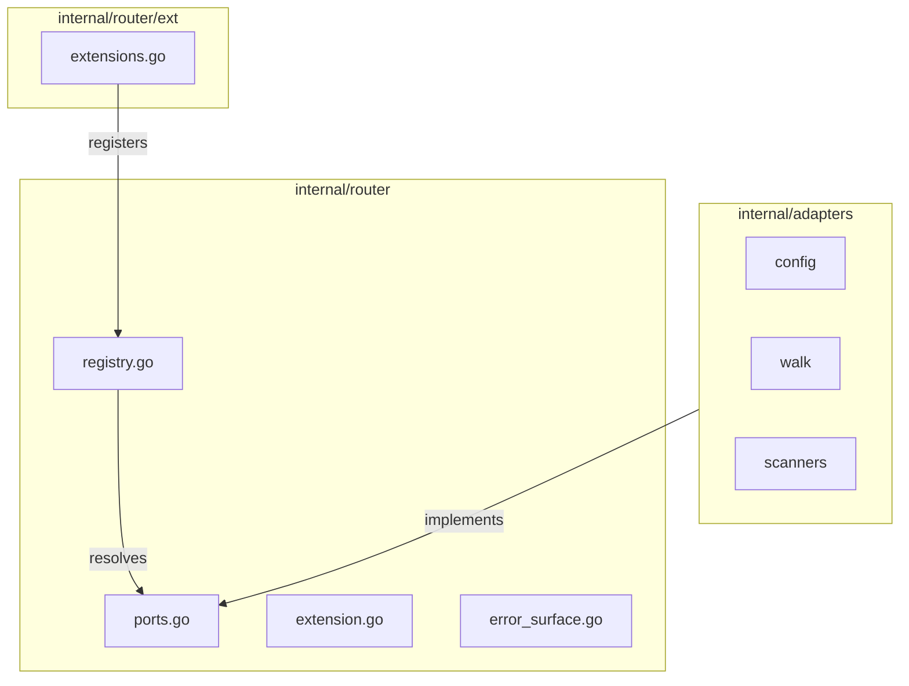

# Router Package Documentation

The router package provides a zero-dependency port registry and extension boot machinery for the policyengine project.

## Overview

The router implements an extension-based dependency injection system with:

- **Port-based registry**: Providers are registered and resolved by named ports
- **Extension lifecycle**: Required and optional extensions with async initialization support
- **Lock-free reads**: Atomic pointer-based registry for high-performance concurrent access
- **Structured errors**: Comprehensive error catalog with contextual error messages

## Architecture



## Core Concepts

### Ports

Ports are typed identifiers for provider capabilities:

| Port            | Description                   |
| --------------- | ----------------------------- |
| `PortConfig`    | Configuration provider        |
| `PortWalk`      | Filesystem walk provider      |
| `PortScanner`   | Code scanner provider         |
| `PortTelemetry` | Telemetry provider (optional) |

### Extensions

Extensions register providers during boot:

- **Required**: Boot fails if registration fails
- **Optional**: Boot continues with warnings on failure
- **Async**: Support for asynchronous initialization

### Registry

The registry uses `atomic.Pointer` for lock-free reads after boot:

```go
provider, err := router.RouterResolveProvider(router.PortWalk)
```

## CLI Tools

### wrlk

Manage port generation, router lock verification, and live sessions:

```bash
# Add a new port
go run ./internal/router/tools/wrlk add --name PortFoo --value foo

# Dry-run a new port addition
go run ./internal/router/tools/wrlk add --name PortFoo --value foo --dry-run

# Verify lock file
go run ./internal/router/tools/wrlk lock verify

# Update lock file
go run ./internal/router/tools/wrlk lock update

# Run live verification
go run ./internal/router/tools/wrlk live run --expect participant1 --timeout 30s
```

## File Structure

```
internal/router/
├── doc.go                 # Package documentation
├── ports.go              # Port type definitions
├── registry.go           # Provider resolution
├── registry_imports.go   # Registry implementation
├── extension.go          # Extension interfaces & boot
├── error_surface.go      # Error handling
├── test_reset.go        # Test utilities
├── router.lock          # Lock file
├── ext/
│   ├── doc.go
│   ├── extensions.go     # Required extensions
│   ├── optional_extensions.go
│   └── telemetry_example.go
└── tools/
    └── wrlk/           # Portgen, Lock, and Live tools

internal/tests/router/
├── boot_test.go
├── restricted_test.go
├── registration_test.go
├── resolution_test.go
├── helpers_test.go
├── benchmark_test.go
└── tools/
    └── wrlk/
```

## Usage

See [usage.md](usage.md) for detailed usage instructions.

## Design Principles

1. **Zero dependencies in core**: `internal/router` imports nothing from `internal/adapters`
2. **Clean architecture**: Adapters implement ports defined in `internal/ports`
3. **Type safety**: Port names are strongly typed
4. **Immutable after boot**: Registry is read-only after initialization
5. **Fail fast**: Required extension failures abort boot immediately

## Error Codes

| Code                       | Description                    |
| -------------------------- | ------------------------------ |
| `PortUnknown`              | Port not declared in whitelist |
| `PortDuplicate`            | Port already registered        |
| `InvalidProvider`          | Provider is nil                |
| `PortNotFound`             | Port not registered            |
| `RegistryNotBooted`        | Resolution before boot         |
| `RequiredExtensionFailed`  | Required extension error       |
| `OptionalExtensionFailed`  | Optional extension error       |
| `DependencyOrderViolation` | Dependency not satisfied       |
| `AsyncInitTimeout`         | Async initialization timeout   |
| `MultipleInitializations`  | Boot called twice              |
| `PortAccessDenied`         | Consumer not allowed           |

## Testing

Run router tests:

```bash
go test ./internal/tests/router/... -v
```

Run benchmarks:

```bash
go test ./internal/tests/router/... -bench=. -benchtime=3s
```

## See Also

- [Usage Guide](usage.md)
- [Code Review](router-review.md)
- [Architecture Diagram](architecture_diagram.mmd)
